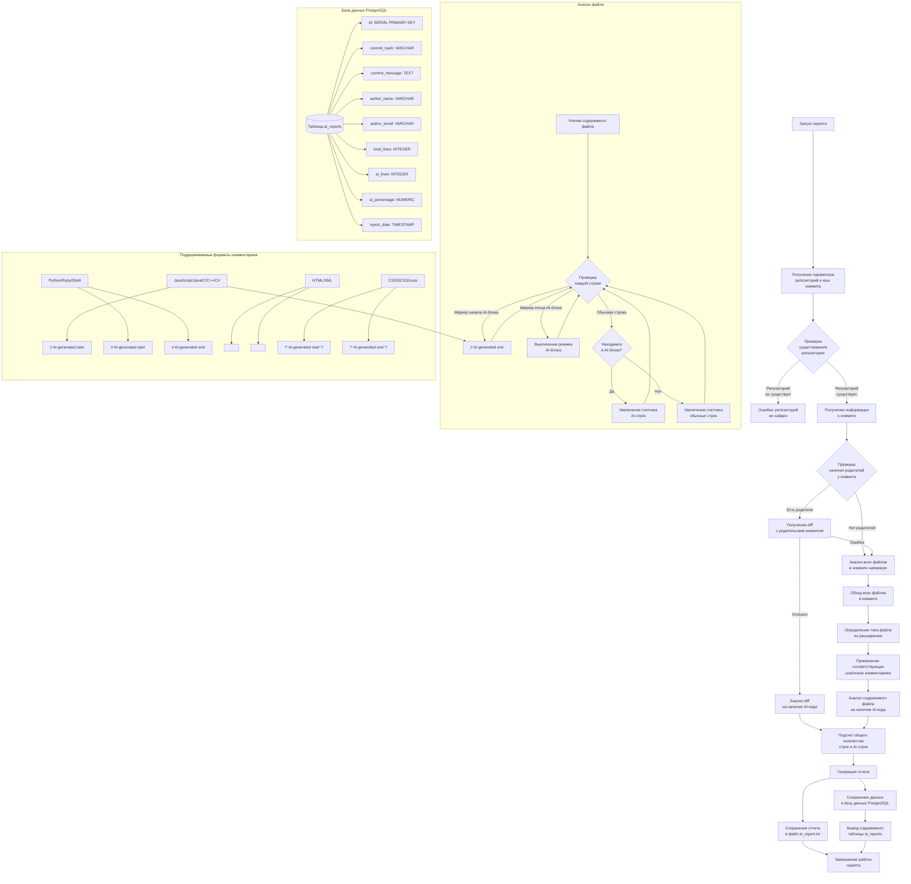

# AI-analyzer_code

# Графическая схема работы скрипта анализа AI-генерированного кода

Ниже представлена схема работы скрипта `ai_code_analyzer_final.py`, который анализирует коммиты Git на наличие AI-генерированного кода и сохраняет результаты в базу данных PostgreSQL.

## Описание основных компонентов схемы

1. **Запуск и инициализация**:
   - Скрипт принимает два параметра: путь к репозиторию и хеш коммита
   - Проверяет существование репозитория и доступность коммита

2. **Анализ коммита**:
   - Для обычных коммитов: анализирует diff с родительским коммитом
   - Для первого коммита: анализирует все файлы напрямую
   - При ошибках с diff: переключается на прямой анализ файлов

3. **Анализ файлов**:
   - Определяет тип файла по расширению
   - Применяет соответствующие шаблоны комментариев
   - Анализирует содержимое файла строка за строкой
   - Подсчитывает общее количество строк и AI-строк

4. **Генерация отчета**:
   - Создает подробный отчет с информацией о коммите
   - Дозаписывает отчет в файл ai_report.txt
   - Сохраняет данные в базу данных PostgreSQL
   - Выводит содержимое таблицы ai_reports

5. **База данных**:
   - Таблица ai_reports содержит информацию о проанализированных коммитах
   - Каждая запись включает хеш коммита, сообщение, автора, количество строк и процент AI-кода

6. **Поддерживаемые форматы комментариев**:
   - JavaScript/Java/C/C++/C#: `// AI-generated start` и `// AI-generated end`
   - Python/Ruby/Shell: `# AI-generated start` и `# AI-generated end`
   - HTML/XML: `<!-- AI-generated start -->` и `<!-- AI-generated end -->`
   - CSS/SCSS/Less: `/* AI-generated start */` и `/* AI-generated end */`

Эта схема наглядно демонстрирует процесс работы скрипта, начиная от получения параметров и заканчивая сохранением результатов анализа в базу данных и файл отчета.
